  <!-- ==================== HEADER BANNER ==================== -->
  

 

<!-- ==================== ABOUT & PROFILE BOX ==================== -->
<table border="1" width="100%" style="background-color: #0d1117; border-color: #21262d; border-radius: 6px; padding: 18px 24px; font-family: -apple-system, BlinkMacSystemFont, 'Segoe UI', Helvetica, Arial, sans-serif;">
<tr>
<td>

<table border="0" width="100%">
  <tr>
    <td align="left"><h3>WHO I AM</h3></td>
    <td align="right"></td>
  </tr>
</table>

Hey, I'm <b>Fachri</b> — a Purwokerto-based <b>Junior Frontend Developer</b> passionate about building clean, responsive web applications and crafting intuitive user interfaces. I focus on turning ideas and designs into pixel-perfect code with modern web standards.

 

<table border="0" width="100%">
  <tr>
    <td align="left"><h3>WHAT I DO</h3></td>
    <td align="right"></td>
  </tr>
</table>

I specialize in frontend technologies including <b>React</b>, <b>JavaScript</b>, and <b>Tailwind CSS</b>, alongside fullstack integration with <b>Laravel</b>. Continuously learning modern state management, component architecture, and responsive web practices.

 

<table border="0" width="100%">
  <tr>
    <td align="left"><h3>VISION</h3></td>
    <td align="right"></td>
  </tr>
</table>

My goal is to build accessible, smooth, and human-first web experiences. Clean code, responsive layouts, and thoughtful design details that make software a joy to use.

 

<table border="0" width="100%">
  <tr>
    <td align="left"><h3>BEYOND CODE</h3></td>
    <td align="right"></td>
  </tr>
</table>

Cinematic photography, visual media, minimalist hardware setups, and continuous personal growth outside of programming.

</td>
</tr>
</table>

 

<!-- ==================== CONNECT / SOCIAL MATRIX ==================== -->
<table border="1" width="100%" style="background-color: #0d1117; border-color: #21262d; border-collapse: collapse;">
  <tr align="center" style="font-family: monospace; font-size: 13px; color: #8b949e;">
    <th width="8%">#</th>
    <th width="15%"><b>Linkedin</b></th>
    <th width="15%"><b>X (Twitter)</b></th>
    <th width="15%"><b>Gmail</b></th>
    <th width="15%"><b>Website</b></th>
    <th width="16%"><b>Instagram</b></th>
    <th width="16%"><b>GitHub</b></th>
    <th width="8%">#</th>
  </tr>
  <tr align="center" style="height: 64px;">
    <td></td>
    <td>
      
    </td>
    <td>
      
    </td>
    <td>
      
    </td>
    <td>
      
    </td>
    <td>
      
    </td>
    <td>
      
    </td>
    <td></td>
  </tr>
</table>

 

<!-- ==================== GITHUB STATS BOX ==================== -->
<table border="1" width="100%" style="background-color: #0d1117; border-color: #21262d; border-radius: 6px; padding: 18px 24px; font-family: -apple-system, BlinkMacSystemFont, 'Segoe UI', Helvetica, Arial, sans-serif;">
<tr>
<td>

<table border="0" width="100%">
  <tr>
    <td align="left"><h3>GITHUB STATS</h3></td>
    <td align="right"></td>
  </tr>
</table>

 

  
  &nbsp;&nbsp;
  
    
  

</td>
</tr>
</table>

 

<!-- ==================== 3D ISOMETRIC CONTRIBUTION GRAPH ==================== -->

  

 

<!-- ==================== SKILL SET GRID ==================== -->
<table border="0" width="100%">
  <tr>
    <td align="left"><h3>SKILL SET</h3></td>
    <td align="right"></td>
  </tr>
</table>

<table border="0" style="margin-top: 10px;">
  <!-- Row 1: Frontend Core -->
  <tr align="center">
    <td width="72" style="padding: 10px 4px;"> <b>HTML</b></td>
    <td width="72" style="padding: 10px 4px;"> <b>CSS</b></td>
    <td width="72" style="padding: 10px 4px;"> <b>JS</b></td>
    <td width="72" style="padding: 10px 4px;"> <b>TypeScript</b></td>
    <td width="72" style="padding: 10px 4px;"> <b>React</b></td>
    <td width="72" style="padding: 10px 4px;"> <b>Tailwind</b></td>
    <td width="72" style="padding: 10px 4px;"> <b>Bootstrap</b></td>
    <td width="72" style="padding: 10px 4px;"> <b>Sass</b></td>
  </tr>
  <!-- Row 2: Backend & Tools -->
  <tr align="center">
    <td width="72" style="padding: 10px 4px;"> <b>PHP</b></td>
    <td width="72" style="padding: 10px 4px;"> <b>Laravel</b></td>
    <td width="72" style="padding: 10px 4px;"> <b>MySQL</b></td>
    <td width="72" style="padding: 10px 4px;"> <b>Vite</b></td>
    <td width="72" style="padding: 10px 4px;"> <b>Git</b></td>
    <td width="72" style="padding: 10px 4px;"> <b>GitHub</b></td>
    <td width="72" style="padding: 10px 4px;"> <b>VS Code</b></td>
    <td width="72" style="padding: 10px 4px;"> <b>Figma</b></td>
  </tr>
</table>

 

  Designed &amp; Crafted by <b>Muhammad Fachri Arfan</b> · Junior Frontend Developer

